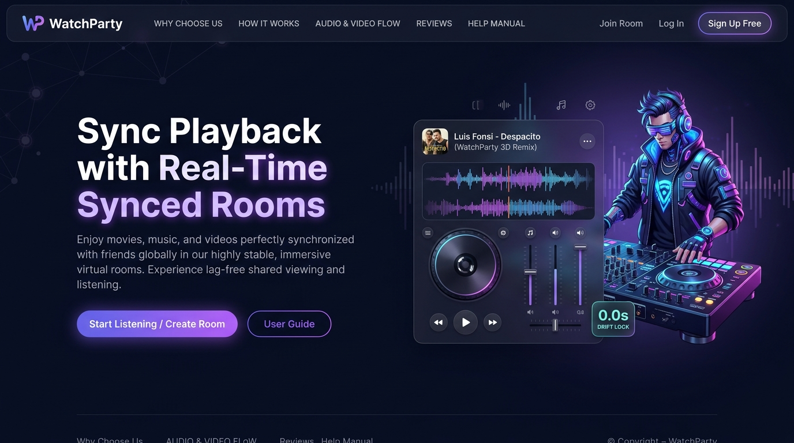
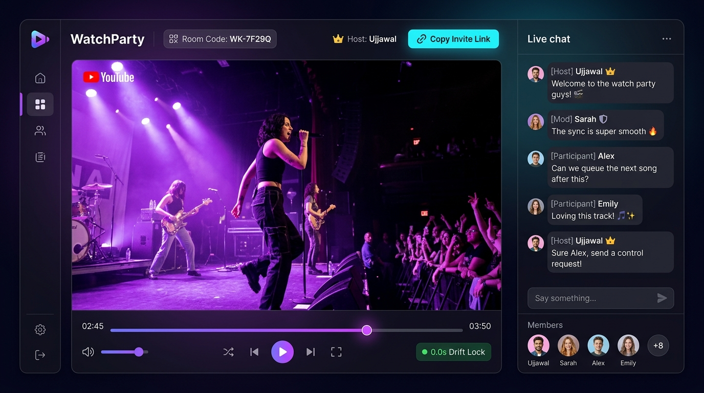

# WatchParty 🎬

> **Real-Time YouTube Watch Party Web Application** with server-authoritative playback synchronization, granular role-based access control (Host, Moderator, Participant), live chat, and control requests.

---

## 🌐 Live Application

🚀 **Live Website:** [https://watch-party-frontend-a3my.onrender.com](https://watch-party-frontend-a3my.onrender.com)

---

## 📸 Screenshots & Previews

### 1. Landing Page & Hero Stage


### 2. Live Synced Room (Synchronized Playback & Real-Time Chat)


---

## 1. Overview

**WatchParty** allows multiple users across different browsers and devices to watch the same YouTube video together with millisecond-accurate synchronization. When the Host or a Moderator plays, pauses, seeks, or changes the video, every participant's player reflects the update instantly.

### Core Flow:
1. A user creates a Watch Party and automatically becomes the **Host**.
2. The room gets a unique code (e.g. `WK-7F29Q`) and a shareable link (`/join/WK-7F29Q` or `/room/WK-7F29Q`).
3. Others join via code or link and become **Participants**.
4. Everyone watches the same video at the exact same position with continuous drift correction.
5. Host and Moderators control playback directly. Participants can submit control requests (Play, Pause, Seek, Change Video) for Host/Moderator approval.
6. Host can promote/demote Moderators, transfer Host status, remove participants, and end the room.
7. Room state and playback stay consistent for late joiners and reconnecting users.

---

## 2. Key Features

- **⚡ Server-Authoritative Synchronization:** Playback state, monotonic versioning, and time calculation reside on the backend. Clients are purely renderers of truth.
- **🛡️ Granular Role-Based Access Control (RBAC):** Every WebSocket event is validated server-side by checking `socket.id -> participant -> room -> role`. Unauthorized events are rejected.
- **🔄 Loop & Echo Prevention:** `isApplyingRemoteUpdate` guards ensure remote state applications never re-emit events back to the server.
- **🕒 Clock Offset & Drift Estimation:** NTP-like ping exchange calculates client-to-server clock offset for sub-second precision across time zones.
- **📡 Resilient Reconnection & Identity:** Session tokens stored in `localStorage` allow seamless reconnection on page refresh or network drop without losing identity or role.
- **✋ Control Request System:** Participants can request Play, Pause, Seek, or Video changes, appearing in the Host/Moderator inbox for one-click approval or rejection.
- **💬 Real-Time Live Chat:** Fast, rate-limited, and HTML-sanitized chat with role badges and system messages.
- **🎨 Dark-First Modern UI:** Built with Tailwind CSS, custom glassmorphism, Lucide icons, Sonner toasts, and mobile/tablet responsive tabs.
- **🔊 Autoplay Restriction Handling:** Graceful "Join Live Playback" overlay handles browser audio autoplay restrictions smoothly.

---

## 3. Tech Stack

- **Frontend:** React 18, TypeScript, Vite, Tailwind CSS, Lucide React, React Router v6, Socket.IO Client, YouTube IFrame Player API, Sonner.
- **Backend:** Node.js, Express, TypeScript, Socket.IO, Zod, Helmet, CORS, Express Rate Limit.
- **Database:** SQLite via Prisma ORM for development; schema is 100% PostgreSQL-compatible.
- **Monorepo:** npm workspaces (`@watchparty/shared`, `@watchparty/backend`, `@watchparty/frontend`).

---

## 4. Architecture & WebSocket Flow

```mermaid
graph TD
    ClientA[Client A (Host)] <-->|WebSocket / REST| Server[Node.js + Socket.IO Server]
    ClientB[Client B (Moderator)] <-->|WebSocket| Server
    ClientC[Client C (Participant)] <-->|WebSocket| Server
    Server <-->|Authoritative State| InMem[(In-Memory Room Store)]
    Server <-->|Durable Persistence| DB[(SQLite / PostgreSQL via Prisma)]
```

### How WebSockets Integrate with the Flow:
- **Bi-directional Real-Time Events:** Clients connect via Socket.IO. Actions like `playback:play`, `playback:pause`, and `playback:seek` are sent to the server.
- **State Validation & Monotonic Versioning:** Server verifies user permissions (Host/Mod), updates in-memory room state, increments state version, and broadcasts `playback:state_changed` to all connected sockets in that room.
- **Drift Correction on Clients:** Each client computes the expected video time using the server timestamp and local clock offset. If drift exceeds 1.5 seconds, the client seeks to the exact position.
- **Control Request Pipeline:** Participant control actions emit `request:submit` which notifies Host/Mods via `request:created`. Once approved (`request:resolve`), the server updates and broadcasts the new state.

---

## 5. Project Structure

```
watch_party/
├── assets/                    # Project screenshots & preview images
├── shared/                    # Shared types, Zod schemas, and event maps
│   └── src/
│       ├── types.ts           # Domain models & payload interfaces
│       ├── schemas.ts         # Zod schemas for all events and REST requests
│       └── events.ts          # Typed ClientToServer & ServerToClient events
├── backend/                   # Express + Socket.IO + Prisma Backend
│   ├── prisma/
│   │   └── schema.prisma      # SQLite / PostgreSQL schema
│   ├── src/
│   │   ├── models/            # Room and Participant OOP classes
│   │   ├── services/          # RoomManager, PermissionService, RateLimiter
│   │   ├── websocket/         # Socket.IO setup and event handlers
│   │   └── server.ts          # Server bootstrap
├── frontend/                  # React + Vite + Tailwind Frontend
│   └── src/
│       ├── components/        # VideoPlayer, Controls, ParticipantList, Chat
│       ├── context/           # RoomProvider & reducer
│       ├── hooks/             # useYouTubePlayer, usePermissions, useRoom
│       ├── pages/             # Landing, CreateRoom, JoinRoom, RoomPage
│       └── services/          # typed Socket.IO singleton & REST client
```

---

## 6. Local Setup & Running

```bash
# 1. Install all monorepo dependencies
npm install

# 2. Setup environment files
cp backend/.env.example backend/.env
cp frontend/.env.example frontend/.env

# 3. Initialize Database
npx prisma db push --schema=backend/prisma/schema.prisma

# 4. Build shared types
npm run build --workspace=@watchparty/shared

# 5. Run both frontend and backend concurrently
npm run dev
```

- **Frontend:** `http://localhost:5173`
- **Backend Server:** `http://localhost:4000`

---

## 7. Multi-User Demo & Testing

1. Open `http://localhost:5173` (or the [Live Website](https://watch-party-frontend-a3my.onrender.com)) in your browser.
2. Click **Create Room**, enter your name, and paste any YouTube video URL (becomes **👑 Host**).
3. Copy the Room Code / Share Link and open it in an **Incognito Window** or another browser to join as a **👤 Participant**.
4. **Test Sync:** Play, pause, or seek on the Host window — watch the Participant player sync instantly.
5. **Test Requests:** From the Participant window, click **Request Control** — approve it from the Host window.
6. **Test Chat:** Send messages in the chat panel with real-time role badges and timestamps.
